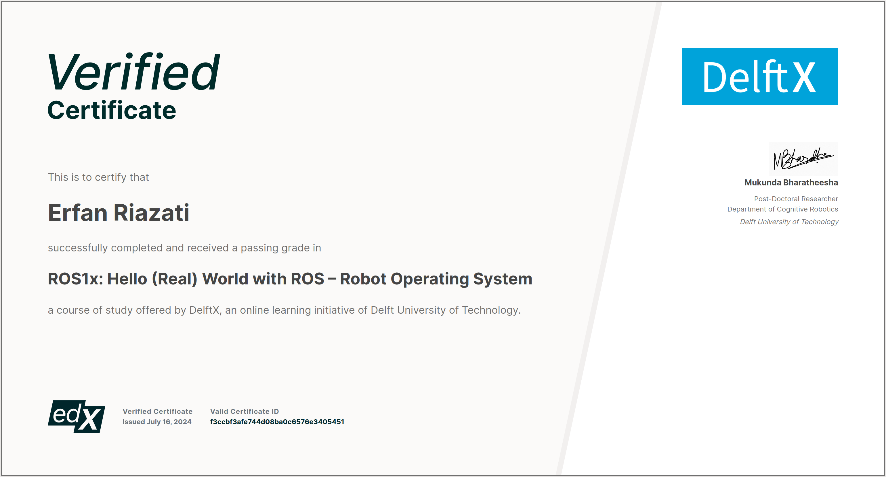
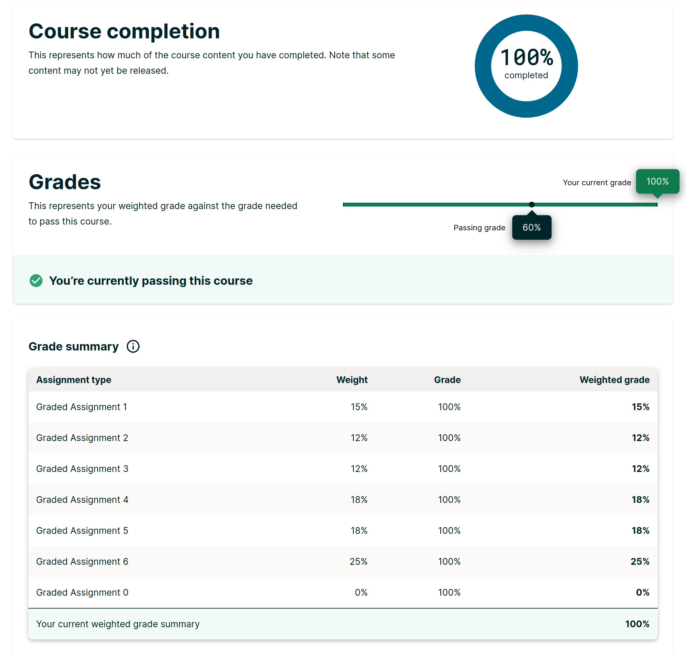

[](https://creativecommons.org/licenses/by-nc-sa/4.0/)
[](https://releases.ubuntu.com/focal/)
[](http://wiki.ros.org/noetic)

<div align="justify">

# Hello (REAL) World with ROS
The Robot Operating System (ROS) enables you to quickly build robotic applications through access to a large set of open-source software and tools. Over the years, ROS has become the essential tool for roboticists. A large community surrounds ROS and there has been extensive input from industrial users in the development of these tools.

TU Delft offers the MOOC [**Hello (Real) World with ROS**](https://www.edx.org/learn/robotics/delft-university-of-technology-hello-real-world-with-ros-robot-operating-system) which is available on the edX online learning platform. The course is self-paced, free, and will remain open until October 13, 2024. 

Subsequently, this repository represents my work through this course. It is tried to present worthwhile summaries along with profound practices and additional resources. However, there might be some limitations on providing full answers to the quizes and computer assignments according to the edX Honor Code.

</br>

# Syllabus
On this section you will find information about the course's outline and content. The course is made up of 7 weeks:

**Week 0: Course setup** 
- Installation of Ubuntu-Linux, course simulation setup and supporting software.

**Week 1: ROS Essentials** 
- Introduction to ROS Topics, Services, Actions, and Nodes.
- Simple interaction with the course simulation environment.

**Week 2: Build your own robot environment** 
- Software representation of a Robot using Unified Robot Description Format (URDF).
- ROS parameter server and adding real-world object representations to the simulation environment.

**Week 3: Autonomous Navigation** 
- Map creation with GMapping package.
- Autonomously navigate a known map with ROS navigation.

**Week 4: Manipulation** 
- Motion planning, pick and place behaviors using industrial robots with ROS MoveIt!

**Week 5: Robot Vision** 
- Object detection, pose estimation, and Transforms in ROS.

**Week 6: Final Project** 
- ROS file system, basic concepts of behavior design with state machines using FlexBE.
- Build a production line application with two industrial robot arms and a mobile robot.

</br>

# Course Conventions
During this course, we will follow a few general conventions about how we name things, what we use to show examples to students, or how we refer to certain folders on your computer. Every convention will be detailed on this section, so please read it through carefully. 

## General Conventions
Lines starting with a `$` are shell input. The `$` is part of the prompt, not of the command. It should not be typed into the course command shell or terminal.

Do **NOT** forget to source your workspace! Include the command source `$HOME/hrwros_ws/devel/setup.bash`. This needs to be done in every course command shell.

In the point above, we use the `$HOME` environment variable to point to a location on your computer. Throughout the course, either `/home/$USER` or `$HOME` might be used. These two environment variables essentially point to the same location, so don't be confused by them!

Never try to mix `catkin_make` commands with `catkin` commands. They are not compatible. In the context of the MOOC, we never use `catkin_make`.

## Singularity
The Course Command Shell (CCS) via Singularity provides a platform where you can execute ROS commands. The folder or files you create from the CCS are also reflected in your Linux installation in the corresponding folder. So, when you want to edit the files while doing assignments, it is not necessary to be in the CCS.

The Singularity image is read-only. You can **NOT** use sudo apt-get to install new ROS or Ubuntu packages into it.

Only use the Singularity version provided in by the MOOC instructors!

> `⚠️` **WARNING**
> 
> **DO NOT** install singularity using `apt-get` or from any other way source than the one provided as they will not work.

You only have to source the noetic setup files **ONCE**!

```bash
$   source /opt/ros/noetic/setup.bash
```

Subsequently, you will only be sourcing your workspace setup files with:

```bash
$   source <path_to_your_workspace>/devel/setup.bash
```


## ROS Distribution
All the course material uses the **Noetic** distribution of ROS, which is currently the recommended distribution for ROS.

> `🚨` **IMPORTANT**
> 
> ROS Noetic only supports Python 3. Please keep this in mind when programming!

</br>

# Setup the ROS Workspace
To set up your own workspace, you must use the following command. This setup only needs to be done once!

```bash
$   source /opt/ros/noetic/setup.bash
```

After that, you need to use the following command to source your workspace. You will need to do this every time you go into a new Course Command Shell!

```bash
$   source $HOME/hrwros_ws/devel/setup.bash
```

</br>

# Capstone Project
For this you will use all that you have learned to create the behavior for the complete factory simulation.

<div align="center">
  
</div>

</br>

# Certificate
I successfully completed the course with a perfect grade in July 2024.

<div align="center">
  
</div>

</br>

<div align="center">
  
</div>

</br>

# License
### CC BY-NC-SA 4.0
The materials of this course are Copyright Delft University of Technology and are licensed under a Creative Commons Attribution-NonCommercial-ShareAlike (CC-BY-NC-SA) 4.0 International License.

### edX Honor Code
Put simply, the edX Honor Code states that, by enrolling in an edX course or program, you agree that you will:
- Complete all tests and assignments on your own, unless collaboration on an assignment is explicitly permitted.
- Maintain only one user account, unless edX has approved the use of a separate user account in connection with an employer-sponsored or university-sponsored program.
- Not let anyone else use your username and/or password.
- Not engage in any activity that would dishonestly improve your results, or improve or hurt the results of others.
- Not post answers to problems that are being used to assess learner performance.

You’ll find the entire edX honor code [here](https://www.edx.org/learn/robotics/delft-university-of-technology-hello-real-world-with-ros-robot-operating-system).


</div>

<br />

[![CC BY-NC-SA 4.0][cc-by-nc-sa-image]][cc-by-nc-sa]

[cc-by-nc-sa]: http://creativecommons.org/licenses/by-nc-sa/4.0/
[cc-by-nc-sa-image]: https://licensebuttons.net/l/by-nc-sa/4.0/88x31.png
[cc-by-nc-sa-shield]: https://img.shields.io/badge/License-CC%20BY--NC--SA%204.0-lightgrey.svg
